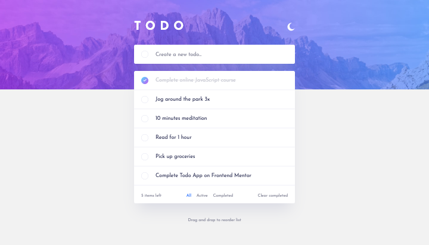

# Frontend Mentor - Todo app solution

This is a solution to the [Todo app challenge on Frontend Mentor](https://www.frontendmentor.io/challenges/todo-app-Su1_KokOW). Frontend Mentor challenges help you improve your coding skills by building realistic projects.

## Table of contents

- [Overview](#overview)
  - [The challenge](#the-challenge)
  - [Screenshot](#screenshot)
  - [Links](#links)
- [My process](#my-process)
  - [Built with](#built-with)
  - [What I learned](#what-i-learned)
  - [Useful resources](#useful-resources)
- [Author](#author)

## Overview

### The challenge

Users should be able to:

- View the optimal layout for the app depending on their device's screen size
- See hover states for all interactive elements on the page
- Add new todos to the list
- Mark todos as complete
- Delete todos from the list
- Filter by all/active/complete todos
- Clear all completed todos
- Toggle light and dark mode
- **Bonus**: Drag and drop to reorder items on the list

### Screenshot

### Links

- Solution URL: [FrontEnd-Mentor](https://www.frontendmentor.io/challenges/fylo-dark-theme-landing-page-5ca5f2d21e82137ec91a50fd/hub/fylodarktheme-using-css-grid-txLFwS4RM)
- Live Site URL: [netlify](https://frontend-mentor-promathieuthiry.netlify.app/fm12-todo-app-main)

## My process

### Built with

- React
- Styled Components
- [react-beautiful-dnd](https://github.com/atlassian/react-beautiful-dnd) - Library for the Drag and Drop

### What I learned

I used the library React beautiful dnd to make items draggable.
I also learned also about creating light/dark mode easily thanks to theming with styled components.

### Useful resources

- [Drag and drop tutorial](https://www.youtube.com/watch?v=y1w6C9A5a2A&ab_channel=AfzalHossain) - This helped me to use the react-beautiful-dnd library.
- [Dark mode](https://www.smashingmagazine.com/2020/04/dark-mode-react-apps-styled-components/) - This is an article which helped me to implement dark mode in React with styled-components.

## Author

- Website - [mathieuthiry.fr](https://mathieuthiry.fr/)
- Frontend Mentor - [@promathieuthiry](https://www.frontendmentor.io/profile/promathieuthiry)
- Twitter - [@mathieu_thiry](https://twitter.com/mathieu_thiry)
