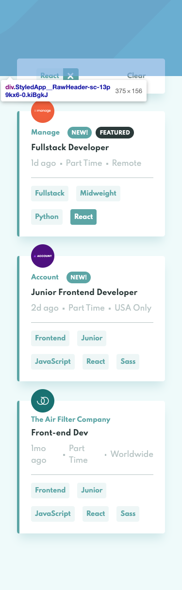

# Frontend Mentor - Job listings with filtering solution

This is a solution to the [Job listings with filtering challenge on Frontend Mentor](https://www.frontendmentor.io/challenges/job-listings-with-filtering-ivstIPCt). Frontend Mentor challenges help you improve your coding skills by building realistic projects.

## Table of contents

- [Overview](#overview)
  - [The challenge](#the-challenge)
  - [Screenshot](#screenshot)
  - [Links](#links)
- [My process](#my-process)
  - [Built with](#built-with)
  - [What I learned](#what-i-learned)
  - [Useful resources](#useful-resources)
- [Author](#author)

## Overview

### The challenge

Users should be able to:

- View the optimal layout for the site depending on their device's screen size
- See hover states for all interactive elements on the page
- Filter job listings based on the categories

### Screenshot

### Links

- Solution URL: [FrontEnd-Mentor](https://www.frontendmentor.io/challenges/job-listings-with-filtering-ivstIPCt)
- Live Site URL: [netlify](https://mathieu-thiry-static-job-listings.netlify.app/)

## My process

### Built with

- React
- Styled Components
- Parcel

### What I learned

I used parcel instead of Create React App. I spent some time with the configuration with ESLint, Prettier.

### Useful resources

- [Import Dynamically images with Parcel](https://stackoverflow.com/questions/69342223/how-to-import-all-images-from-folder-in-js) - Need to install 2 plugins `@parcel/transformer-image` and `@parcel/resolver-globI` to import all local images.

## Author

- Website - [mathieuthiry.fr](https://mathieuthiry.fr/)
- Frontend Mentor - [@promathieuthiry](https://www.frontendmentor.io/profile/promathieuthiry)
- Twitter - [@mathieu_thiry](https://twitter.com/mathieu_thiry)
