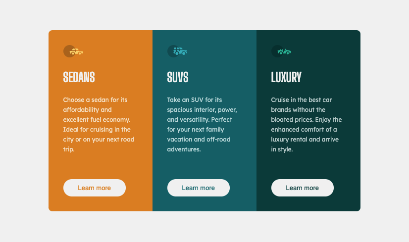

# Frontend Mentor - 3-column preview card component solution

This is a solution to the [3-column preview card component challenge on Frontend Mentor](https://www.frontendmentor.io/challenges/3column-preview-card-component-pH92eAR2-). Frontend Mentor challenges help you improve your coding skills by building realistic projects. 

## Table of contents

- [Overview](#overview)
  - [The challenge](#the-challenge)
  - [Screenshot](#screenshot)
  - [Links](#links)
- [My process](#my-process)
  - [Built with](#built-with)
  - [What I learned](#what-i-learned)
- [Author](#author)
- [Acknowledgments](#acknowledgments)

## Overview

### The challenge

Users should be able to:

- View the optimal layout depending on their device's screen size
- See hover states for interactive elements

### Screenshot




### Links

- Solution URL: [FrontEnd-Mentor](https://www.frontendmentor.io/challenges/3column-preview-card-component-pH92eAR2-/hub/3-column-preview-card-usign-flexbox-_LcDu4X5j)
- Live Site URL: [netlify](https://frontend-mentor-promathieuthiry.netlify.app/fm3-column-preview-card-component-main/index.html)

## My process

### Built with

- Only HTML5 and CSS
- Flexbox

### What I learned

I learned how to use global variable in css to avoid redundant declaration, especially for colors. 

To see how you can add code snippets, see below:

```css
:root {
    --light-gray: hsl(0, 0%, 95%);
  }

  body {
    background-color: var(--light-gray);
}
```
Also, to optimize code I used nested class in CSS see below snippet:

```css
#card-sedans button {
    color: hsl(31, 77%, 52%);
    font-size: 13px;
}
```

But this is not efficient if you applied an effect on hover with the transform property. The effect starts when the page load.

## Author

- Website - [mathieuthiry.fr](https://mathieuthiry.fr/)
- Frontend Mentor - [@promathieuthiry](https://www.frontendmentor.io/profile/promathieuthiry)
- Twitter - [@mathieu_thiry](https://twitter.com/mathieu_thiry)


