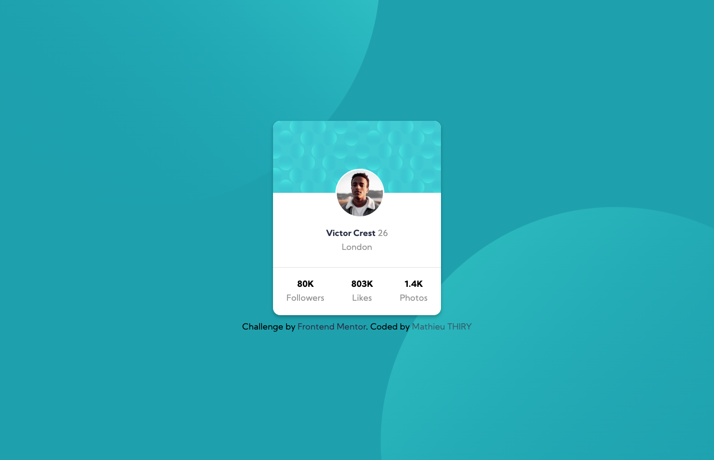
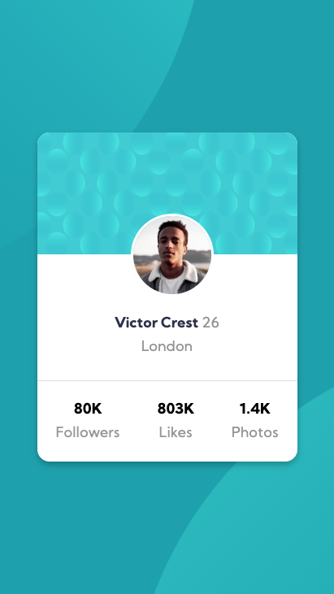

# Frontend Mentor - Profile card component solution

This is a solution to the [Profile card component challenge on Frontend Mentor](https://www.frontendmentor.io/challenges/profile-card-component-cfArpWshJ). Frontend Mentor challenges help you improve your coding skills by building realistic projects. 

## Table of contents

- [Overview](#overview)
  - [The challenge](#the-challenge)
  - [Screenshot](#screenshot)
  - [Links](#links)
- [My process](#my-process)
  - [Built with](#built-with)
  - [What I learned](#what-i-learned)
- [Author](#author)


## Overview

### The challenge

- Build out the project to the designs provided

### Screenshot




### Links

- Solution URL: [FrontEnd-Mentor](https://www.frontendmentor.io/challenges/profile-card-component-cfArpWshJ/hub/profile-card-using-flexbox-iAYrsZfJ_)
- Live Site URL: [netlify](https://frontend-mentor-promathieuthiry.netlify.app/fm5-profile-card-component-main/index.html)


## My process

### Built with

- Only HTML5 and CSS
- Flexbox

### What I learned


In order to make the svg responsive and keep half cropped, I used the css property translate, see below:

To see how you can add code snippets, see below:

```css
#bg-pattern-top {
    position: absolute;
    transform: translate(-45%, -55%);
}
```

## Author

- Website - [mathieuthiry.fr](https://mathieuthiry.fr/)
- Frontend Mentor - [@promathieuthiry](https://www.frontendmentor.io/profile/promathieuthiry)
- Twitter - [@mathieu_thiry](https://twitter.com/mathieu_thiry)
