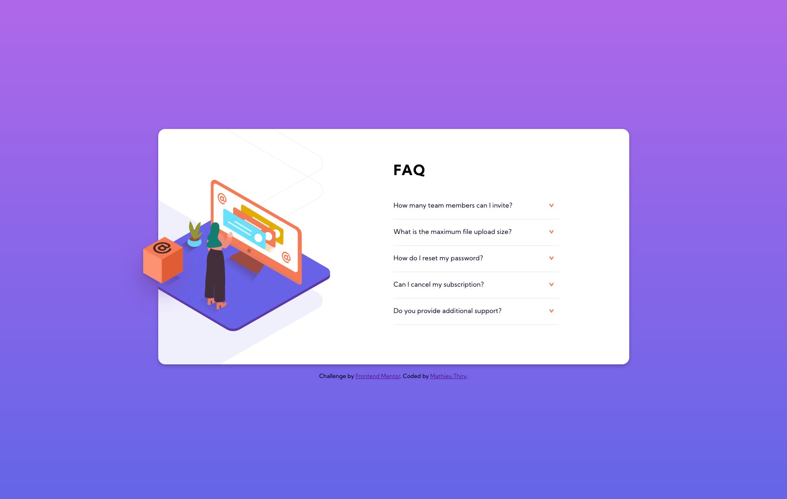

# Frontend Mentor - FAQ accordion card solution

This is a solution to the [FAQ accordion card challenge on Frontend Mentor](https://www.frontendmentor.io/challenges/faq-accordion-card-XlyjD0Oam). Frontend Mentor challenges help you improve your coding skills by building realistic projects. 

## Table of contents

- [Overview](#overview)
  - [The challenge](#the-challenge)
  - [Screenshot](#screenshot)
  - [Links](#links)
- [My process](#my-process)
  - [Built with](#built-with)
  - [What I learned](#what-i-learned)
  - [Useful resources](#useful-resources)
- [Author](#author)

## Overview

### The challenge

Users should be able to:

- View the optimal layout for the component depending on their device's screen size
- See hover states for all interactive elements on the page
- Hide/Show the answer to a question when the question is clicked

### Screenshot




### Links

- Solution URL: [FrontEnd-Mentor](https://www.frontendmentor.io/solutions/accordion-using-css-lsankI_9q)
- Live Site URL: [netlify](https://frontend-mentor-promathieuthiry.netlify.app/fm6-faq-accordion-card-main/index.html)

## My process

### Built with

- Only HTML5 and CSS
- Flexbox

### What I learned

In order to make element outside of the parent not visible, I used the property overflow: hidden like below :

```css
#col-1 {
    position: relative;
    overflow: hidden;
}
#background {
    position: absolute;
    bottom: -75px;
    left: -400px;
}
```

In order to to make the accordeon I used the input trick like below :

```css

.accordeon-text input {
    display: none;
}
.accordeon-text .content {
    overflow: hidden;
    max-height: 0;
}

.accordeon-text input:checked ~ .content { max-height: 100vh;  }
```

### Useful resources

- [Create CSS Accordion without JavaScript](https://codeconvey.com/css-accordion-without-javascript/) - This article helped me how to make the accordion with just css.

## Author

- Website - [mathieuthiry.fr](https://mathieuthiry.fr/)
- Frontend Mentor - [@promathieuthiry](https://www.frontendmentor.io/profile/promathieuthiry)
- Twitter - [@mathieu_thiry](https://twitter.com/mathieu_thiry)

