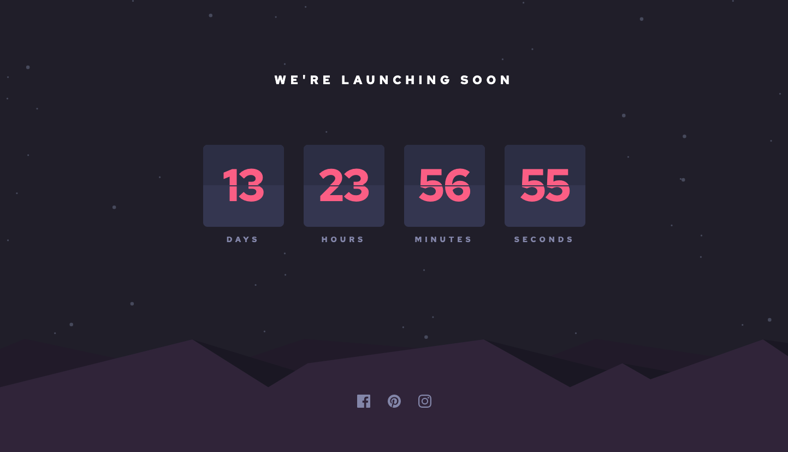
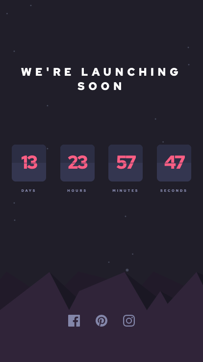

# Frontend Mentor - Launch countdown timer solution

This is a solution to the [Launch countdown timer challenge on Frontend Mentor](https://www.frontendmentor.io/challenges/launch-countdown-timer-N0XkGfyz-). Frontend Mentor challenges help you improve your coding skills by building realistic projects. 

## Table of contents

- [Overview](#overview)
  - [The challenge](#the-challenge)
  - [Screenshot](#screenshot)
  - [Links](#links)
- [My process](#my-process)
  - [Built with](#built-with)
  - [What I learned](#what-i-learned)
  - [Continued development](#continued-development)
- [Author](#author)


## Overview

### The challenge

Users should be able to:

- See hover states for all interactive elements on the page
- See a live countdown timer that ticks down every second (start the count at 14 days)
- **Bonus**: When a number changes, make the card flip from the middle

### Screenshot




### Links

- Solution URL: [FrontEnd-Mentor](https://www.frontendmentor.io/challenges/launch-countdown-timer-N0XkGfyz-/hub/countdown-with-sass-FdUY9DyDs)
- Live Site URL: [netlify](https://frontend-mentor-promathieuthiry.netlify.app/fm9-launch-countdown-timer-main/index.html)

## My process

### Built with

- Flexbox
- SASS
- Javascript

### What I learned

I learned how to make a countdown using setInterval builtin javascript function.

To see how you can add code snippets, see below:

```js
let future = new Date();
future.setDate(future.getDate() + 14)
const futur2 = future.getTime()

const x = setInterval(function () {

    const currentTime = new Date().getTime();

    const distance = futur2 - currentTime;

    const days = Math.floor(distance / (1000 * 60 * 60 * 24));
  
    const daysText = document.getElementsByClassName("days");
    
    for (let i = 0; i < daysText.length; i++) {
        daysText[i].innerHTML = days
    }

}, 1000);
```

### Continued development

I did not succeed the bonus "When a number changes, make the card flip from the middle". I want to make my design even more responsive with fluid layout using clamp()


## Author

- Website - [mathieuthiry.fr](https://mathieuthiry.fr/)
- Frontend Mentor - [@promathieuthiry](https://www.frontendmentor.io/profile/promathieuthiry)
- Twitter - [@mathieu_thiry](https://twitter.com/mathieu_thiry)